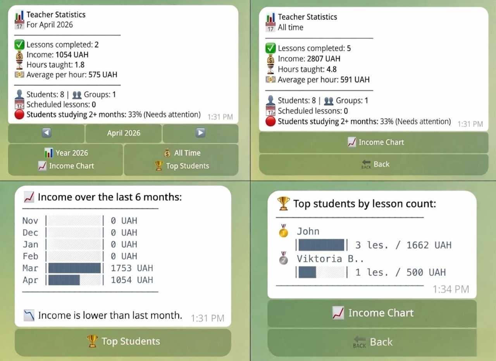
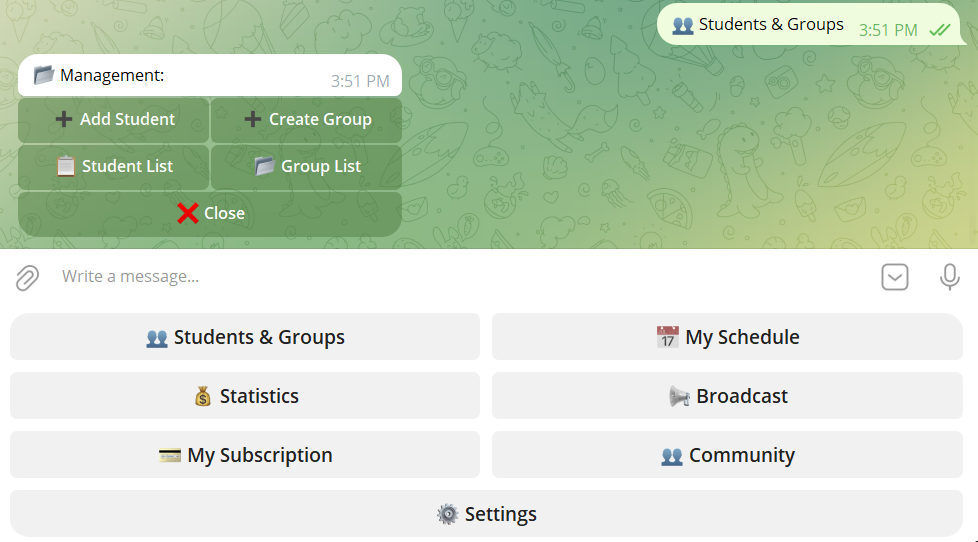

# capish-tutor-bot
A Telegram-based platform for freelance English tutors to manage students, lessons, payments and homework — all in one place.

🔗 Try it: [@Capish_Tutor_bot](https://t.me/Capish_Tutor_bot)

---

## The Problem

Freelance English tutors typically manage their work through spreadsheets, messaging apps and notebooks. This leads to:

- Missed lessons due to no automated reminders
- Lost income from untracked payments and balances
- No visibility into business performance
- Time wasted on admin instead of teaching

---

## The Solution

A multi-role Telegram bot that acts as a complete management platform for tutors.

---

## User Roles

| Role | Description |
|------|-------------|
| Teacher | Manages students, lessons, homework, payments and analytics |
| Student | Views schedule, submits homework, tracks balance |
| Admin | Manages teachers and platform subscriptions |

---

## Core Features

- **Lesson Scheduling** — one-time and recurring lessons with automated reminders 24h and 1h before
- **Balance Tracking** — per-student balance with automatic deduction after each lesson
- **Homework System** — assign tasks, students submit, teacher reviews
- **Statistics Dashboard** — monthly income, hours taught, retention rate, churn risk
- **Student Booking** — students request available slots, teacher approves
- **Bilingual** — full Ukrainian and English support

---

## Data Model

9 tables covering the full tutor-student lifecycle:

| Table | Purpose |
|-------|---------|
| teachers | Tutor accounts and subscription status |
| students | Student profiles and lesson balance |
| lessons | Scheduled and completed lessons |
| homeworks | Assignments and student submissions |
| vocabulary | Flashcard system for vocabulary training |
| availability | Teacher free time slots |
| booking_requests | Student booking requests |
| groups | Group class management |
| logs | Action audit trail |

---

## Key Process Flows

**Lesson lifecycle:**
Planned → Reminded (24h + 1h) → Completed → Balance deducted → Feedback requested

**Booking flow:**
Student requests slot → Teacher approves/rejects → Lesson created automatically

**Payment flow:**
Teacher selects plan → Sends payment proof → Admin verifies → Subscription activated

---

## Product Decisions

| Decision | Choice | Reason |
|----------|--------|--------|
| Platform | Telegram | Already used daily by target audience |
| Database | SQLite | Simple and fast for MVP stage |
| Language | Ukrainian + English | Primary market is Ukrainian tutors |

---
## Screenshots

## Status

Currently live and being tested with real users.
